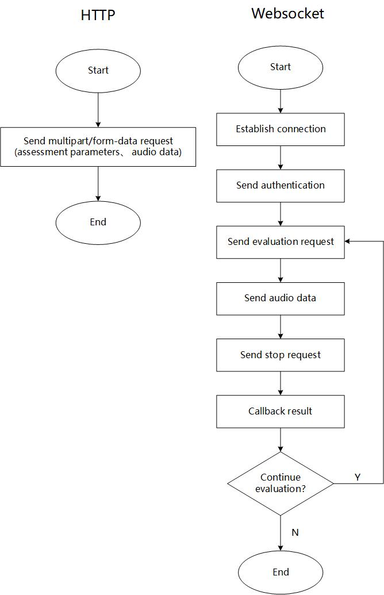

# API samples for SpeechSuper

## Highlights
SpeechSuper provides cutting-edge **AI speech assessment** service for spoken languages learners. We have been working with hundreds of partners to enable their products to rate learners' spoken language proficiency. SpeechSuper analyzes learner's audio and returns fine grained score covering various aspects: pronunciation, fluency, completeness, rhythm, stress, liaison etc. It is quite easy to integrate SpeechSuper APIs into your own applications using our code samples. 

Some more prominent features are listed below:

* **Instant feedback:** real time feedback while the user is speaking
* **Phoneme level mispronunciation detection:** detect phoneme mispronunciation including insertion, deletion or substitution
* **Spoken languages covered:** English, Chinese, German, French, Russian, Korean, Japanese, Spanish (more to come)
* **Coding languages supported:** Java, C/C++, Swift, golang, php, C#, Unity, Javascript, Objective-C, Python, Node, Rust etc.
* **Platforms supported:** iOS, Android, Web, Windows, MacOS, Linux etc.

## Getting Started
1. Get your appKey and secretKey. (这里可以说明如何获取)

2. Git clone this project to your local
```
git clone https://github.com/speechsuper/speechsuper-api-samples.git
```

3. Choose the example of your interest. We have [http](https://github.com/speechsuper/speechsuper-api-samples/tree/main/http_samples) / [websocket](https://github.com/speechsuper/speechsuper-api-samples/tree/main/websocket_samples) samples in numerous coding languages. Fill in your appKey and secretKey: 
``` 
appKey = "Insert your appKey here"
secretKey = "Insert your secretKey here"
```

4. Change the inputs according to your needs
```
coreType = "sent.eval" // sentence scoring
refText = "The successful warrior is the average man with laser-like focus." // reference text
audioPath = "The audio path of the spoken sentence." 
audioType = "wav"
```

5. Launch 🚀 your code and get the result.

## How it works 
### Flowchart


## Demo

Find demos [here](https://www.speechsuper.com/demo/english/index.html)

## Support
Contact support@speechsuper.com for technical support.
